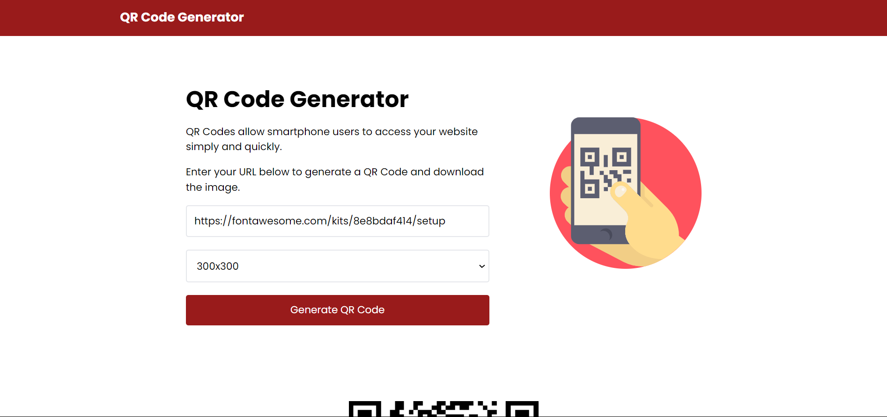
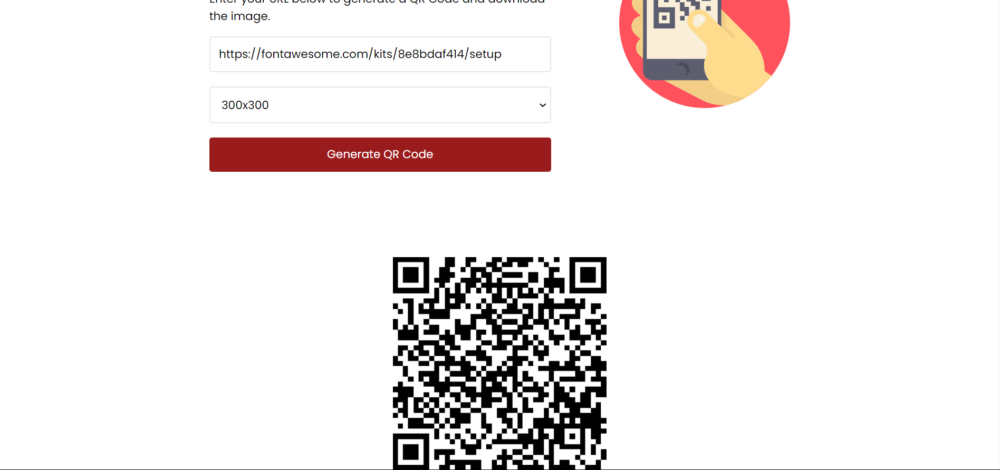

# QR Code Generator

Welcome to the QR Code Generator project, a web application that allows users to generate QR codes for URLs using a QR Code API.

## Overview

This project provides a simple interface to generate QR codes for URLs. Users can enter a URL, choose the size of the QR code, and download the generated QR code image.

## Features

- **Generate QR Code:** Enter a URL and select the size to generate a QR code dynamically.
- **Download QR Code:** Save the generated QR code as an image file (PNG format).
- **Responsive Design:** Built with Tailwind CSS for a responsive and modern UI across different devices.

## Technologies Used

- **HTML5:** Structure of the webpage.
- **Tailwind CSS:** Styling framework for UI components and responsiveness.
- **JavaScript (Vanilla):** Client-side scripting for dynamic functionality.
- **QR Code API:** Integration with a QR Code generation API for generating QR codes dynamically.
